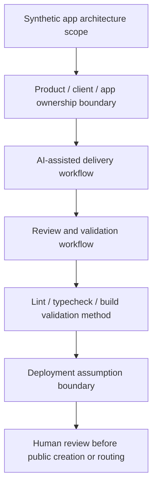

# Public-Safe Next.js Architecture

Status: scaffolded

## Problem Statement

Define a public-safe application architecture pattern that shows how a modern web app can be scoped, reviewed, validated, and bounded without exposing live apps, active customers, production endpoints, credentials, customer data, private source, unreleased product internals, or released software claims.

## Synthetic App Architecture Context

The example app is a synthetic operations dashboard for managing mock engineering review records. It has no production backend, customer tenant, live deployment, real users, private source, production endpoints, credentials, customer data, or active customer workflow.

The architecture is intended to demonstrate review discipline:

- define scope before implementation;
- separate product, client, and app ownership;
- document AI-assisted delivery checkpoints;
- require lint, typecheck, and build validation where code exists;
- hold deployment, release, and proof-completion claims until human review.

## Next.js / TypeScript / Tailwind / shadcn/ui Structure

| Layer | Public-safe scaffold role | Boundary |
| --- | --- | --- |
| Next.js app shell | Documents route groups, layout boundaries, and page ownership using synthetic names | No live app routes, private source, or production endpoints |
| TypeScript domain types | Describes mock review records, status labels, and validation states | No customer schemas or private data models |
| Tailwind tokens | Captures generic spacing, color, and density decisions | No private design system or client branding |
| shadcn/ui components | Lists reusable table, dialog, form, badge, and command patterns | No client UI, unreleased product internals, or production screenshots |
| Validation scripts | Defines lint/typecheck/build checks where implementation exists | No production logs or released software claims |

## Product / Client / App Ownership Boundary

| Surface | Public-safe statement | Held out |
| --- | --- | --- |
| Personal proof | May show synthetic app architecture and review discipline | No active customer or service offering claim |
| Product architecture | May describe generic product-grade app structure | No unreleased product internals or private source |
| Client-owned app | Must be treated as separate ownership | No client-owned source, customer data, or app confusion |
| Deployment surface | May describe assumptions only | No deployed software, production endpoint, uptime, or release claim |

## AI-Assisted Delivery Workflow

1. Scope the synthetic app surface and boundary class.
2. Draft the architecture note and identify held material.
3. Generate or patch scaffold code only inside approved paths.
4. Run lint/typecheck/build validation where code exists.
5. Perform claim review for live app, active customer, deployed software, released software, and production-readiness language.
6. Hand off to human review before metadata, routing, publication, release, or proof-stack changes.

## Review And Validation Workflow

| Review gate | Check | Result posture |
| --- | --- | --- |
| Boundary review | Confirms synthetic content and no private source | Required before public creation |
| Ownership review | Separates product, client, personal proof, and app ownership | Required before public creation |
| AI-assisted delivery review | Confirms scoped task, validation, and human approval | Required before public creation |
| Claim review | Blocks live app, active customer, deployment, release, and proof-completion claims | Required before publication |

## Lint / Typecheck / Build Validation Method

For this scaffold, validation is documentation-first:

```bash
scripts/validate-public-boundary.sh
rg -n "planned|scaffolded|published|released|private/not-public|live apps|active customers|deployed software|released software|production endpoints|credentials|customer data|private source|unreleased product|production secrets|validation|review" .
git diff --check
git status --short
git remote -v
```

If future synthetic code examples are added, the validation method should also include:

```bash
npm run lint
npm run typecheck
npm run build
```

Those future commands must be treated as scaffold validation only, not deployment proof, release proof, or active customer evidence.

## Deployment Assumption Boundary

Vercel, Supabase, and Stripe may be referenced only as generic architecture and boundary examples. This scaffold does not include live apps, production endpoints, credentials, production secrets, customer data, active customers, deployed software, released software, or production readiness evidence.

## Mermaid App Delivery Review Diagram



## Validation Questions

- Does the architecture use only synthetic app names, routes, components, and records?
- Does it avoid live apps, active customers, deployed software, released software, and production-readiness claims?
- Does it avoid private source, production endpoints, credentials, customer data, private logs, internal prompts, live tool tokens, and production secrets?
- Does it separate personal proof, generic product architecture, client-owned apps, and deployment assumptions?
- Does it define validation without treating validation as release evidence?

## What This Proves

- A public-safe app architecture can name framework choices, ownership boundaries, review gates, validation methods, and deployment assumptions.
- AI-assisted delivery can be framed as bounded engineering workflow under human review.
- Lint/typecheck/build checks can be planned without implying deployed software or released software.

## What This Does Not Prove

- It does not prove a live app exists.
- It does not prove active customers, deployed software, released software, production readiness, uptime, or customer results.
- It does not expose private source, production endpoints, credentials, customer data, private logs, internal prompts, live tool tokens, or production secrets.
- It does not authorize profile routing, proof-stack routing, GitHub metadata changes, publication, or release.

## Public / Private / Sealed Checklist

| Check | Status |
| --- | --- |
| Status: scaffolded | yes |
| Synthetic app architecture context only | yes |
| No live apps or active customers | yes |
| No deployed software or released software claims | yes |
| No private source or unreleased product internals | yes |
| No production endpoints, credentials, production secrets, or live tool tokens | yes |
| No customer data, Foundation-private data, private logs, or internal prompts | yes |
| Profile routing and proof-stack routing remain planned | yes |
